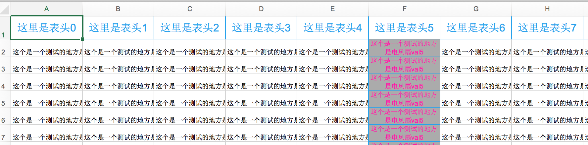
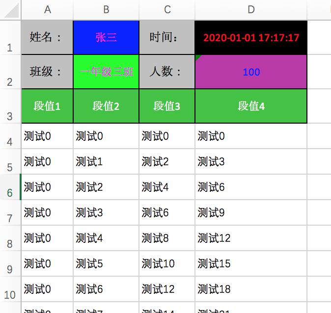
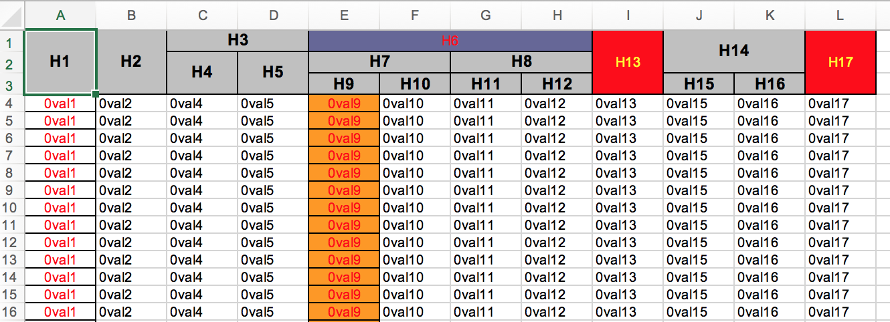
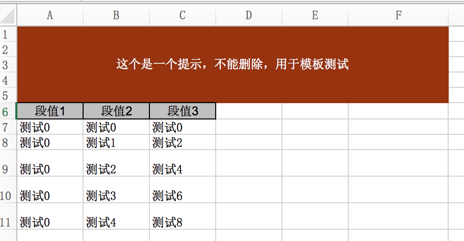

# jk-excel
居于poi，做excel解析，自动识别excel或csv、tsv文件格式，单sheet最大生成百万数据在50秒以内，内存15m左右。

#个人csdn
[个人CSDN](https://blog.csdn.net/lgh1117)

##特性
   支持csv、tsv、excel所有版本

##效果图例
###生成excel样式
1.表头约束

2.表头有特定格式输出

3.复杂表头

4.自定义文档说明

5.根据模板生成新的excel

###文档还在更新中，具体例子可以先看demo里面的代码。。。。。
